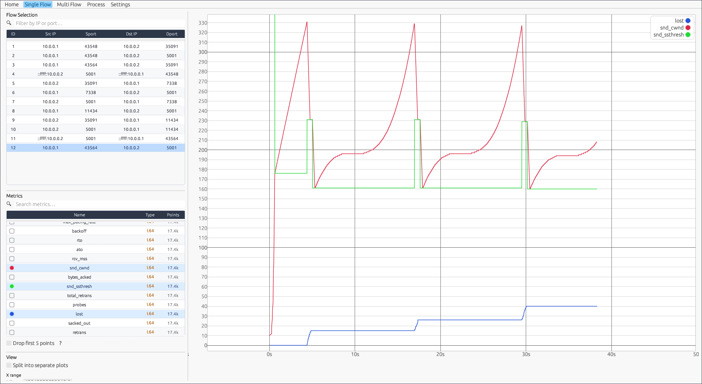
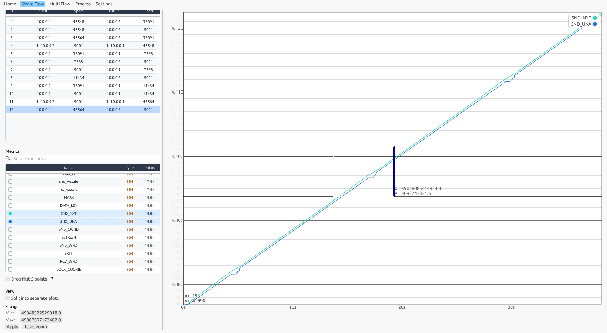
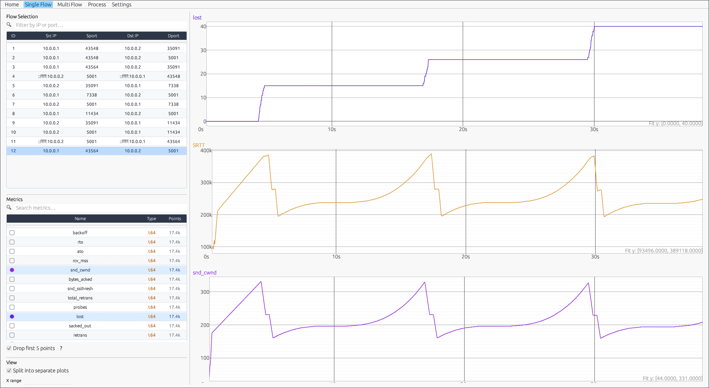
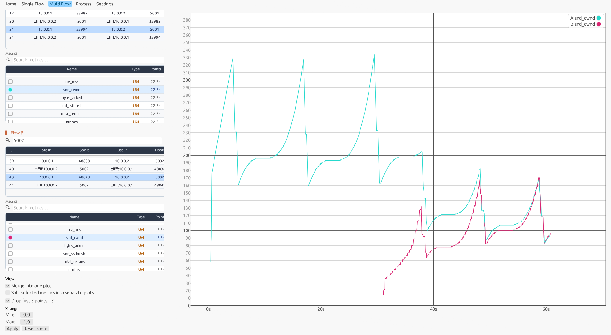

<div align="center">
 
 <h2>TCBee: TCP Flow Analysis with eBPF</h2>

    [](https://github.com/uni-tue-kn/TCBee/actions/workflows/tcbee.yml)

 *Special thanks to [Evelyn](https://github.com/ScatteredDrifter) and Lars for their support during development.*

</div>

TCBee monitors TCP flows at up to 5M events/s. It captures packet headers via TC hooks, reads kernel metrics through eBPF function hooks, and stores everything in a DuckDB or SQLite database for offline analysis and visualization.

**Linux-only.** Tested on kernel 6.13.6.

---

- [Quick Start](#quick-start)
  - [Prerequisites](#prerequisites)
  - [Build](#build)
  - [Record → Process → Visualize](#record--process--visualize)
- [What TCBee Does](#what-tcbee-does)
- [Architecture](#architecture)
- [Usage](#usage)
  - [`tcbee record`](#tcbee-record)
  - [`tcbee process`](#tcbee-process)
  - [`tcbee viz`](#tcbee-viz)
- [tcbee-live](#tcbee-live)
- [Custom Data Access](#custom-data-access)
- [Testing](#testing)
- [Screenshots](#screenshots)
  - [Recording](#recording)
  - [Visualization](#visualization)
- [Status](#status)

---

## Quick Start

### Prerequisites

**Build tools:**
- Clang/LLVM: `sudo apt install -y llvm clang libelf-dev libclang-dev`
- Rust (> 1.28.1): [rustup.rs](https://rustup.rs/)
- Stable + nightly toolchains: `rustup toolchain install stable && rustup toolchain install nightly --component rust-src`
- BPF linker: `cargo install bpf-linker`

**Database libraries:**
- SQLite: `sudo apt install -y libsqlite3-dev` (Arch: `sudo pacman -S sqlite`)
- DuckDB: download the shared library and headers from [duckdb/duckdb releases](https://github.com/duckdb/duckdb/releases) and install them to `/usr/local/`

**Visualization:**
- `sudo apt install -y pkg-config fontconfig libfontconfig1-dev`

**Testing environment:**
- Python 3
- Mininet
- Open vSwitch
- iperf3
- Linux with root privileges for Mininet and eBPF programs

> **Bundled mode:** To statically link SQLite or DuckDB instead of relying on system libraries, enable the `bundled` feature in [ts-storage/Cargo.toml](ts-storage/Cargo.toml). This removes the system dependency at the cost of longer compile times.

### Build

```bash
make           # builds everything; binaries are copied to install/
# or individually:
make record
make process
make viz
make live
```

Move the binaries from `install/` to a directory in your `PATH`. The `tcbee` script dispatches to the right binary based on the subcommand.

Built on the [aya rust template](https://github.com/aya-rs/aya-template).

### Record → Process → Visualize

```bash
# 1. Record a TCP flow (Ctrl+C to stop)
sudo tcbee record -h eth0 -k

# 2. Process the raw recording into a database
tcbee process -d -o /tmp/myflow.duck

# 3. Open the visualization tool
tcbee viz
```

---

## What TCBee Does

- Captures incoming and outgoing TCP headers via XDP and TC eBPF hooks
- Reads kernel TCP metrics (cwnd, ssthresh, srtt, ...) per packet or function call
- Stores recordings in a SQLite or DuckDB database
- Provides a plugin interface to compute derived metrics (e.g. retransmissions, duplicate ACKs) during post-processing
- Includes an interactive visualization tool for plotting and comparing flows
- Exposes a Rust library (`ts-storage`) for building custom analysis tools

---

## Architecture

TCBee works in three phases: **record**, **process**, and **visualize**.


**Record:** attaches eBPF probes and writes raw event data to `*.tcp` files. XDP/TC hooks capture packet headers; function hooks and tracepoints read kernel TCP metrics.

**Process:** reads the raw files and writes a structured SQL database. Plugins run here to compute metrics that are too expensive to calculate live.

**Visualize:** loads the database and displays interactive graphs. You can also query the database directly with your own scripts or tools.

Per-module documentation: [tcbee-record](tcbee-record/README.md) · [tcbee-process](tcbee-process/README.md) · [ts-storage](ts-storage/README.md)

---

## Usage

All subcommands are called through the `tcbee` script.

### `tcbee record`

At least one metric source flag is required.

Metric sources:

| Flag | Description |
|---|---|
| `-h [iface]` | TCP headers via XDP/TC on the given interface |
| `-t` | Kernel tracepoints (most TCP metrics) |
| `-k` | `tcp_sendmsg`/`tcp_recvmsg` hooks (all TCP metrics) |
| `-w` | `snd_cwnd` only (best performance, single metric) |
| `-a` | Congestion control internals (Cubic and BBR) |

Filtering:

| Flag | Default | Description |
|---|---|---|
| `-p PORT` | | Fast single-port filter for source or destination port |
| `--ports PORTS` | | Comma-separated source or destination ports |
| `--src-ports PORTS` | | Comma-separated source ports |
| `--dst-ports PORTS` | | Comma-separated destination ports |
| `--ips IPS` | | Comma-separated source or destination IPv4/IPv6 addresses |
| `--src-ips IPS` | | Comma-separated source IPv4/IPv6 addresses |
| `--dst-ips IPS` | | Comma-separated destination IPv4/IPv6 addresses |

Filtering is disabled by default, so probes only take the fast no-filter branch. Use
`-p`/`--port` when a single local or remote port is enough; this uses the fastest filtered path.
The multi-value port and IP filters use eBPF maps for exact matches. Values inside one option are
ORed, while port and IP dimensions are ANDed. For example, `--ports 80,443 --ips 10.0.0.1`
records traffic where either endpoint port is 80 or 443 and either endpoint IP is `10.0.0.1`.

Other options:

| Flag | Default | Description |
|---|---|---|
| `-d DIR` | `/tmp/` | Output directory for raw recordings |
| `-c N` | `1` | Number of CPUs used for processing |
| `-q` | | Disable the terminal UI |
| `-m` | | Write a `metrics.json` summary file |
| `--tui-update-ms N` | `100` | TUI refresh interval in milliseconds |

Raw data is written as `*.tcp` files to the output directory.

### `tcbee process`

Reads raw recordings and writes a flow database:

```bash
tcbee process -d -o /tmp/myflow.duck    # DuckDB (recommended for large traces)
tcbee process -q -o /tmp/myflow.sqlite  # SQLite
```

| Flag | Default | Description |
|---|---|---|
| `-s DIR` | `/tmp/` | Source directory containing `*.tcp` files |
| `-o FILE` | `/tmp/db.duck` or `.sqlite` | Output database file |

### `tcbee viz`

```bash
tcbee viz
```

Load a `*.sqlite` or `*.duck` file from within the tool. The navigation bar switches between single-flow plots, multi-flow comparison, the processing panel, and settings.

---

## tcbee-live

A live cwnd monitor with no recording or post-processing needed. Attaches eBPF probes and shows congestion window metrics in real time via a GUI.

```bash
make live
sudo ./install/tcbee live --select-port 5001
```

See [tcbee-live/README.md](tcbee-live/README.md) for details.

---

## Custom Data Access

The flow database is standard SQLite or DuckDB and can be queried with any compatible client or library.

- **Rust:** use the `ts-storage` library, see [ts-storage/README.md](ts-storage/README.md)
- **Other languages:** use any SQLite/DuckDB client; see [`examples/db/`](examples/db/) for working examples
- **Raw `*.tcp` files:** packed structs; struct definitions are in [tcbee-record/tcbee-common/src/bindings/](tcbee-record/tcbee-common/src/bindings/) (look for names ending in `_entry`); Python reader examples are in [`examples/raw/`](examples/raw/)

---

## Testing

The [`testing/`](testing/) directory has a Mininet-based emulation environment. It sets up a bottleneck topology, drives traffic with `iperf3`, and launches `tcbee-record`, `tcbee-live`, or the full record/process/visualize pipeline automatically.

Additional packages for the test environment:

```bash
# Debian / Ubuntu
sudo apt install -y mininet openvswitch-switch iperf3 python3

# Arch Linux
sudo pacman -S mininet openvswitch iperf3 python
sudo systemctl start ovsdb-server ovs-vswitchd
```

Before running the tests, build the tools you want to exercise:

```bash
make           # build record, process, viz, and live
# or individually:
make record
make process
make viz
make live
```

Run the launcher from the repository root:

```bash
python3 testing/run.py
```

The launcher needs root-capable networking through Mininet, and `tcbee-record` / `tcbee-live` need eBPF privileges. See [testing/README.md](testing/README.md) for the topology and menu options.

---

## Screenshots

### Recording


### Visualization







---

## Status

This is the first stable release. Work in progress:

- Documentation for all modules
- Merging tools into a single binary
- Plugins for common TCP congestion metrics
- InfluxDB interface for faster processing
- Ringbuffer and file writer benchmarks
- Code cleanup

---

*Developed with AI coding assistance. All code reviewed and verified by human developers before inclusion.*
